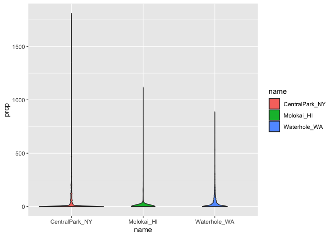

Data Visualization I
================

## Upload the Data

``` r
weather_df = 
  rnoaa::meteo_pull_monitors(
    c("USW00094728", "USW00022534", "USS0023B17S"),
    var = c("PRCP", "TMIN", "TMAX"), 
    date_min = "2021-01-01",
    date_max = "2022-12-31") |>
  mutate(
    name = case_match(
      id, 
      "USW00094728" ~ "CentralPark_NY", 
      "USW00022534" ~ "Molokai_HI",
      "USS0023B17S" ~ "Waterhole_WA"),
    tmin = tmin / 10,
    tmax = tmax / 10) |>
  select(name, id, everything())
```

    ## using cached file: /Users/Joe/Library/Caches/org.R-project.R/R/rnoaa/noaa_ghcnd/USW00094728.dly

    ## date created (size, mb): 2024-09-26 10:18:30.316443 (8.651)

    ## file min/max dates: 1869-01-01 / 2024-09-30

    ## using cached file: /Users/Joe/Library/Caches/org.R-project.R/R/rnoaa/noaa_ghcnd/USW00022534.dly

    ## date created (size, mb): 2024-09-26 10:18:38.190217 (3.932)

    ## file min/max dates: 1949-10-01 / 2024-09-30

    ## using cached file: /Users/Joe/Library/Caches/org.R-project.R/R/rnoaa/noaa_ghcnd/USS0023B17S.dly

    ## date created (size, mb): 2024-09-26 10:18:40.630668 (1.036)

    ## file min/max dates: 1999-09-01 / 2024-09-30

## Make Our First Plot :)

``` r
ggp_weather_scatterplot = 
  weather_df %>%
  ggplot(aes(x = tmin, y = tmax)) + 
  geom_point()

ggp_weather_scatterplot
```

    ## Warning: Removed 17 rows containing missing values or values outside the scale range
    ## (`geom_point()`).

<!-- -->

## Fancier Scatterplots!

``` r
ggp_weather_scatterplot_2 = 
  weather_df %>%
  ggplot(aes(x = tmin, y = tmax, color = name)) + 
  geom_point(alpha = 0.5, size = 0.8) + 
  geom_smooth(se = FALSE)

ggp_weather_scatterplot_2
```

    ## `geom_smooth()` using method = 'loess' and formula = 'y ~ x'

    ## Warning: Removed 17 rows containing non-finite outside the scale range
    ## (`stat_smooth()`).

    ## Warning: Removed 17 rows containing missing values or values outside the scale range
    ## (`geom_point()`).

<!-- -->
Where you define the aesthetics can matter:

``` r
ggp_weather_scatterplot_2.1 = 
  weather_df %>%
  ggplot(aes(x = tmin, y = tmax)) + 
  geom_point(aes(color = name), alpha = 0.5, size = 0.8) + 
  geom_smooth(se = FALSE)

ggp_weather_scatterplot_2.1
```

    ## `geom_smooth()` using method = 'gam' and formula = 'y ~ s(x, bs = "cs")'

    ## Warning: Removed 17 rows containing non-finite outside the scale range
    ## (`stat_smooth()`).

    ## Warning: Removed 17 rows containing missing values or values outside the scale range
    ## (`geom_point()`).

<!-- -->

Let’s use faceting real quick:

``` r
ggp_weather_scatterplot_2.2 = 
  weather_df %>%
  ggplot(aes(x = tmin, y = tmax, color = name)) + 
  geom_point(alpha = 0.5, size = 0.8) + 
  geom_smooth(se = FALSE) + 
  facet_grid (. ~ name)

ggp_weather_scatterplot_2.2
```

    ## `geom_smooth()` using method = 'loess' and formula = 'y ~ x'

    ## Warning: Removed 17 rows containing non-finite outside the scale range
    ## (`stat_smooth()`).

    ## Warning: Removed 17 rows containing missing values or values outside the scale range
    ## (`geom_point()`).

<!-- -->

## A More Interesting Scatterplot

``` r
ggp_weather_scatterplot_3 = 
  weather_df %>%
  ggplot(aes(x = date, y = tmax, color = name, size = prcp)) + 
  geom_point(alpha = 0.5) + 
  geom_smooth(se = FALSE) + 
  facet_grid(. ~ name)

ggp_weather_scatterplot_3
```

    ## Warning: Using `size` aesthetic for lines was deprecated in ggplot2 3.4.0.
    ## ℹ Please use `linewidth` instead.
    ## This warning is displayed once every 8 hours.
    ## Call `lifecycle::last_lifecycle_warnings()` to see where this warning was
    ## generated.

    ## `geom_smooth()` using method = 'loess' and formula = 'y ~ x'

    ## Warning: Removed 17 rows containing non-finite outside the scale range
    ## (`stat_smooth()`).

    ## Warning: The following aesthetics were dropped during statistical transformation: size.
    ## ℹ This can happen when ggplot fails to infer the correct grouping structure in
    ##   the data.
    ## ℹ Did you forget to specify a `group` aesthetic or to convert a numerical
    ##   variable into a factor?
    ## The following aesthetics were dropped during statistical transformation: size.
    ## ℹ This can happen when ggplot fails to infer the correct grouping structure in
    ##   the data.
    ## ℹ Did you forget to specify a `group` aesthetic or to convert a numerical
    ##   variable into a factor?
    ## The following aesthetics were dropped during statistical transformation: size.
    ## ℹ This can happen when ggplot fails to infer the correct grouping structure in
    ##   the data.
    ## ℹ Did you forget to specify a `group` aesthetic or to convert a numerical
    ##   variable into a factor?

    ## Warning: Removed 19 rows containing missing values or values outside the scale range
    ## (`geom_point()`).

<!-- -->

## Learning Assessment

``` r
ggp_weather_LA_plot = 
  weather_df %>%
  filter(name == "CentralPark_NY") %>%
  mutate(tmax_F = tmax * (9/5) + 32,
         tmin_F = tmin * (9/5) + 32) %>%
  ggplot(aes(x = tmin_F, y = tmax_F)) + 
  geom_point(alpha = 0.8) + 
  geom_smooth(method = "lm", se = FALSE)

ggp_weather_LA_plot
```

    ## `geom_smooth()` using formula = 'y ~ x'

<!-- -->
\## Small Things

Sometimes, a hex plot can work better with large datasets (\> 10000 data
points)

``` r
weather_df %>%
  ggplot(aes(x = tmin, y = tmax)) + 
  geom_hex()
```

    ## Warning: Removed 17 rows containing non-finite outside the scale range
    ## (`stat_binhex()`).

<!-- -->
Be careful where you specify colors - if you do it in the aesthetic
mappings command, ggplot will interpret “blue” as a variable rather than
a color, making the plot red instead:

``` r
weather_df %>%
  ggplot(aes(x = tmin, y = tmax, color = "blue")) + 
  geom_point()
```

    ## Warning: Removed 17 rows containing missing values or values outside the scale range
    ## (`geom_point()`).

<!-- -->

``` r
weather_df %>%
  ggplot(aes(x = tmin, y = tmax)) + 
  geom_point(color = "blue")
```

    ## Warning: Removed 17 rows containing missing values or values outside the scale range
    ## (`geom_point()`).

<!-- -->
\## Univariate Plots

#### Histograms

``` r
weather_df %>%
  ggplot(aes(x = tmin)) + 
  geom_histogram()
```

    ## `stat_bin()` using `bins = 30`. Pick better value with `binwidth`.

    ## Warning: Removed 17 rows containing non-finite outside the scale range
    ## (`stat_bin()`).

<!-- -->

``` r
weather_df %>%
  ggplot(aes(x = tmin, fill = name)) + 
  geom_histogram(position = "dodge")
```

    ## `stat_bin()` using `bins = 30`. Pick better value with `binwidth`.

    ## Warning: Removed 17 rows containing non-finite outside the scale range
    ## (`stat_bin()`).

<!-- -->
Using facets can help make the previous plot easier on the eyes:

``` r
weather_df %>%
  ggplot(aes(x = tmin, fill = name)) + 
  geom_histogram(color = "black") + 
  facet_grid(. ~ name)
```

    ## `stat_bin()` using `bins = 30`. Pick better value with `binwidth`.

    ## Warning: Removed 17 rows containing non-finite outside the scale range
    ## (`stat_bin()`).

<!-- -->
That plot wasn’t excellent either, so let’s try a density plot instead:

``` r
weather_df %>%
  ggplot(aes(x = tmin, fill = name)) + 
  geom_density(alpha = 0.4)
```

    ## Warning: Removed 17 rows containing non-finite outside the scale range
    ## (`stat_density()`).

<!-- -->
\#### Boxplots

``` r
weather_df %>%
  ggplot(aes(x = name, y = tmin, fill = name)) + 
  geom_boxplot()
```

    ## Warning: Removed 17 rows containing non-finite outside the scale range
    ## (`stat_boxplot()`).

<!-- -->
\#### Violinplots

``` r
weather_df %>%
  ggplot(aes(x = name, y = tmin, fill = name)) + 
  geom_violin()
```

    ## Warning: Removed 17 rows containing non-finite outside the scale range
    ## (`stat_ydensity()`).

<!-- -->
\#### Ridge Plots

These work best when you have plenty of different groups.

``` r
weather_df %>% 
  ggplot(aes(x = tmin, y = name)) + 
  geom_density_ridges()
```

    ## Picking joint bandwidth of 1.41

    ## Warning: Removed 17 rows containing non-finite outside the scale range
    ## (`stat_density_ridges()`).

<!-- -->
\## Learning Assessment 2

Histogram:

``` r
weather_df %>%
  ggplot(aes(x = prcp, fill = name)) +
  geom_histogram(color = "black") + 
  facet_grid (. ~ name)
```

    ## `stat_bin()` using `bins = 30`. Pick better value with `binwidth`.

    ## Warning: Removed 15 rows containing non-finite outside the scale range
    ## (`stat_bin()`).

<!-- -->
Density Plot:

``` r
weather_df %>%
  ggplot(aes(x = prcp, fill = name)) + 
  geom_density(alpha = 0.4)
```

    ## Warning: Removed 15 rows containing non-finite outside the scale range
    ## (`stat_density()`).

<!-- -->

Boxplot:

``` r
weather_df %>%
  ggplot(aes(x = name, y = prcp, fill = name)) +
  geom_boxplot()
```

    ## Warning: Removed 15 rows containing non-finite outside the scale range
    ## (`stat_boxplot()`).

<!-- -->
Violinplot:

``` r
weather_df %>%
  ggplot(aes(x = name, y = prcp, fill = name)) +
  geom_violin()
```

    ## Warning: Removed 15 rows containing non-finite outside the scale range
    ## (`stat_ydensity()`).

<!-- -->

Ridge Plot:

``` r
weather_df %>%
  ggplot(aes(x = prcp, y = name)) + 
  geom_density_ridges()
```

    ## Picking joint bandwidth of 9.22

    ## Warning: Removed 15 rows containing non-finite outside the scale range
    ## (`stat_density_ridges()`).

<!-- -->
None of these look particularly good because the data is so
right-skewed…

``` r
weather_df %>%
  filter(prcp < 750 & prcp > 10) %>%
  ggplot(aes(x = prcp, fill = name)) + 
  geom_density(alpha = 0.4)
```

<!-- -->

## Saving and embedding plots

Saving plots:

``` r
ggp_weather_save = 
  weather_df %>%
  ggplot(aes(x = date, y = tmax, color = name)) + 
  geom_point()

ggsave("ggp_weather.pdf", ggp_weather_save, width = 8, height = 6)
```

    ## Warning: Removed 17 rows containing missing values or values outside the scale range
    ## (`geom_point()`).

Embedding plots:

``` r
ggp_weather_save = 
  weather_df %>%
  ggplot(aes(x = date, y = tmax, color = name)) + 
  geom_point()
```

Note: “fig.asp = .6” instructs the width to be .6 times the height.
